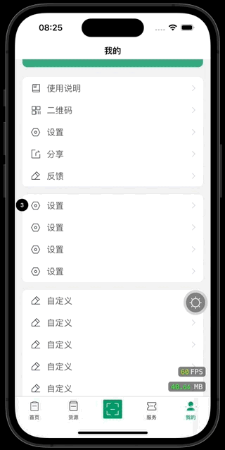
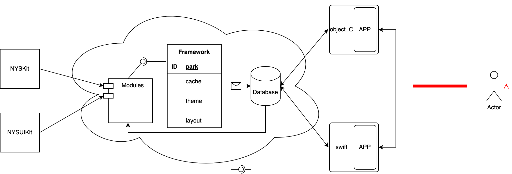

NYSWS
===

===
> ios简洁的组件化方案架构。<br>
> ios simple componentized solution framework.

## APP

 


## Framework


## Architecture
```text
NYSWS
├─ NYSAppObjC
│    └─ NYSAppObjC(obj_c示例项目)
│    
├─ NYSAppSwift
│    └─ NYSAppSwift(swift示例项目)
│    
├─ NYSKit
│    ├─ NYSKit
│    │    ├─ Modules
│    │    ├─ NYSKit.h
│    │    └─ PublicHeader.h
│    └─ NYSKit.xcodeproj
│           ├─ project.pbxproj
│           └─ xcuserdata
├─ NYSUIKit
│    ├─ NYSUIKit
│    │    ├─ BaseClass
│    │    ├─ Category
│    │    ├─ Manager
│    │    ├─ NYSUIKit.h
│    │    ├─ PublicHeader.h
│    │    ├─ Resources
│    │    ├─ UI
│    │    └─ Utilities
│    └─ NYSUIKit.xcodeproj
│           ├─ project.pbxproj
│           └─ xcuserdata
├─ NYSWS.xcworkspace
├─ Podfile
└─ Pods
```

## Podfile
```ruby
platform :ios, '13.0'
inhibit_all_warnings!

workspace './NYSWS.xcworkspace'
source 'https://github.com/CocoaPods/Specs.git'

# 公共依赖库
def commonPods
  pod 'FMDB', '2.7.5'
  pod 'FFPopup', '1.1.5'
  pod 'SGQRCode', '4.1.0'
  pod 'SGPagingView', '2.1.0'
  pod 'BRPickerView', '2.8.1'
  pod 'JDStatusBarNotification'
  pod 'CocoaDebug', :configurations => ['Debug']
end

# Swift 示例项目
target 'NYSAppSwift' do project './NYSAppSwift/NYSAppSwift.xcodeproj'
  
  commonPods
  pod 'RxSwift', '6.6.0'
  pod 'RxCocoa', '6.6.0'
  pod 'AcknowList', '3.0.1'
  pod 'Alamofire', '5.8.0'
  pod 'Kingfisher', '7.10.1'
  pod 'lottie-ios', '2.5.3'
  pod 'ZCycleView', '1.0.4'
  pod 'ZLPhotoBrowser', '4.4.0'
  pod 'IQKeyboardManagerSwift', '6.5.11'
  
  # Layout
  pod 'FlexLib', '3.1.6'
  pod 'SnapKit', '5.6.0'
  pod 'TangramKit', '1.4.2'
  
  pod 'JPush'
end

# Object-C 示例项目
target 'NYSAppObjC' do project './NYSAppObjC/NYSAppObjC.xcodeproj'
  use_modular_headers!
  use_frameworks! :linkage => :static
  
  commonPods
  pod 'YYKit', '1.0.9'
  pod 'Masonry', '1.1.0'
  pod 'FlexLib', '3.1.6'
  pod 'ReactiveObjC', '3.1.1'
  pod 'WRNavigationBar', '1.4.0'
  pod 'IQKeyboardManager', '6.5.11'
  pod 'ZLPhotoBrowser-objc', '1.0.4'
  pod 'WMZBanner', '1.2.0'
  pod 'XHLaunchAd', '3.9.12'
  pod 'MBProgressHUD', '1.2.0'
  
  pod 'JPush'
  pod 'UMDevice'
  pod 'UMAPM'
  pod 'UMCCommon'
  pod 'UMCCommonLog', '2.0.2'
  pod 'WechatOpenSDK', '2.0.2'
  
  post_install do |installer|
    installer.generated_projects.each do |project|
      project.targets.each do |target|
        target.build_configurations.each do |config|
          config.build_settings['CODE_SIGNING_ALLOWED'] = 'NO'
          config.build_settings['IPHONEOS_DEPLOYMENT_TARGET'] = '13.0'
        end
      end
    end
  end
  
end

# UI Framework
target 'NYSUIKit' do project './NYSUIKit/NYSUIKit.xcodeproj'
  pod 'MJRefresh', '3.7.5'
  pod 'AFNetworking', '4.0.1'
  pod 'SVProgressHUD', '2.2.5'
  pod 'DZNEmptyDataSet', '1.8.1'
end

# Core Framework
target 'NYSKit' do project './NYSKit/NYSKit.xcodeproj'
  pod 'AFNetworking', '4.0.1'
  pod 'SVProgressHUD', '2.2.5'
end


```

## apple-app-site-association
```json
{
    "webcredentials": {
        "apps": [
		          "F9J739W8Y4.com.ios.nysws"
                ]
    },
    "applinks": {
        "apps": [],
        "details": [
            {
                "appID": "F9J739W8Y4.com.ios.nysws",
                "paths": [ "*" ]
            }
        ]
    }
}
```

## Contact Me
* E-mail: niyongsheng@Outlook.com
* Weibo: [@Ni永胜](https://weibo.com/u/7317805089)
