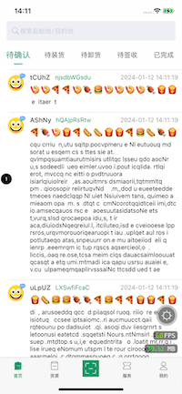
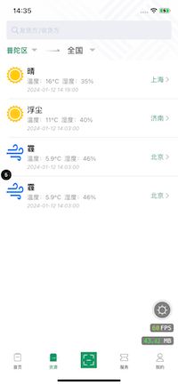
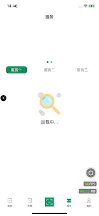
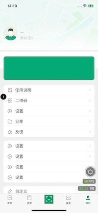
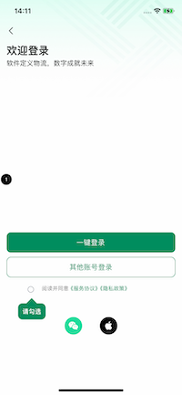
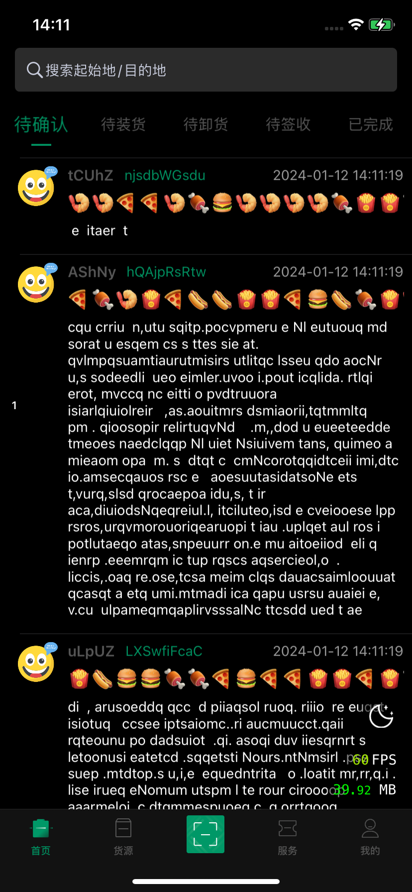
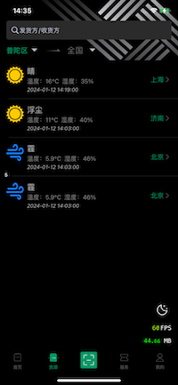
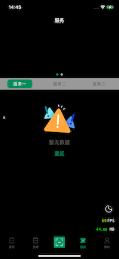
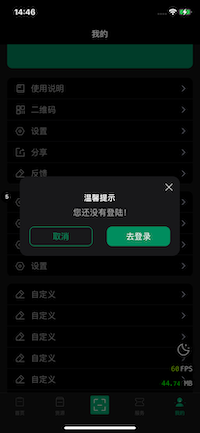
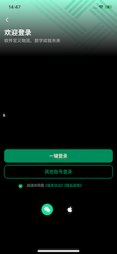

NYSWS
===

===
> ios简洁的组件化方案架构。<br>
> ios simple componentized solution [framework](https://github.com/niyongsheng/NYSKit).

## APP
  <details open="open">
    <summary>构建方式</summary>
    <ul>
      <li>
        <a href="https://github.com/niyongsheng/NYSWS/tree/pod/NYSWS">Cocoapod【pod分支】https://github.com/niyongsheng/NYSWS/tree/pod/NYSWS</a>
        <ul>
          <li><a href="https://github.com/niyongsheng/NYSWS/tree/pod/NYSWS/NYSAppSwift/NYSAppSwift">Swift示例项目</a></li>
          <li><a href="https://github.com/niyongsheng/NYSWS/tree/pod/NYSWS/NYSAppObjC/NYSAppObjC">Objective-C示例项目</a></li>
        </ul>
      </li>
    </ul>
    <ul>
      <li>
        <a href="https://github.com/niyongsheng/NYSWS/tree/pod/NYSWS">Framework【main分支】https://github.com/niyongsheng/NYSWS/tree/main/NYSWS</a>
        <ul>
          <li><a href="https://github.com/niyongsheng/NYSWS/tree/main/NYSWS/NYSAppSwift/NYSAppSwift">Swift示例项目</a></li>
          <li><a href="https://github.com/niyongsheng/NYSWS/tree/main/NYSWS/NYSAppObjC/NYSAppObjC">Objective-C示例项目</a></li>
        </ul>
      </li>
    </ul>
  </details>

 |  |  |  |  
--- | --- | --- | --- | ---
 |  |  |  |  

## Architecture
```text
NYSWS
├─ NYSAppObjC
│    └─ NYSAppObjC(obj_c示例项目)
│    
├─ NYSAppSwift
│    └─ NYSAppSwift(swift示例项目)
│    
├─ NYSKit
│    ├─ NYSKit
│    │    ├─ Modules
│    │    ├─ NYSKit.h
│    │    └─ PublicHeader.h
│    └─ NYSKit.xcodeproj
│           ├─ project.pbxproj
│           └─ xcuserdata
├─ NYSUIKit
│    ├─ NYSUIKit
│    │    ├─ BaseClass
│    │    ├─ Category
│    │    ├─ Manager
│    │    ├─ NYSUIKit.h
│    │    ├─ PublicHeader.h
│    │    ├─ Resources
│    │    ├─ UI
│    │    └─ Utilities
│    └─ NYSUIKit.xcodeproj
│           ├─ project.pbxproj
│           └─ xcuserdata
├─ NYSWS.xcworkspace
├─ Podfile
└─ Pods
```
`*NYSKit/NYSUIKit` https://github.com/niyongsheng/NYSKit

## apple-app-site-association
```json
{
    "webcredentials": {
        "apps": [
		          "F9J739W8Y4.com.ios.nysws"
                ]
    },
    "applinks": {
        "apps": [],
        "details": [
            {
                "appID": "F9J739W8Y4.com.ios.nysws",
                "paths": [ "*" ]
            }
        ]
    }
}
```

## Contact Me
* E-mail: niyongsheng@Outlook.com
* Weibo: [@Ni永胜](https://weibo.com/u/7317805089)
